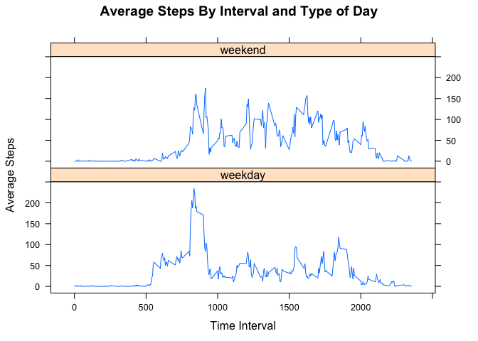

# Reproducible Research: Peer Assessment 1


## Loading and preprocessing the data

```r
activity <- read.csv("activity.csv")
activity$date <- as.Date(activity$date, format='%Y-%m-%d')
```

## What is mean total number of steps taken per day?
#### 1.Make a histogram of the total number of steps taken each day

```r
totalstepsperday <- aggregate(activity$steps~activity$date,activity,sum)
colnames(totalstepsperday) <- c("Date", "Steps")
hist(totalstepsperday$Steps, xlab = "Total Steps Per Day", main = "Total Steps Per Day Histogram")
```

 


#### 2.Calculate and report the mean and median total number of steps taken per day

```r
mean(totalstepsperday$Steps)
```

```
## [1] 10766
```

```r
median(totalstepsperday$Steps)
```

```
## [1] 10765
```

## What is the average daily activity pattern?
#### 1. Make a time series plot (i.e. type = "l") of the 5-minute interval (x-axis) and the average number of steps taken, averaged across all days (y-axis)

```r
tspinterval <- aggregate(activity$steps~activity$interval,activity,mean)
colnames(tspinterval) <- c("Interval", "Steps")
plot(tspinterval$Interval,tspinterval$Steps,type = "l", xlab = "Time Interval", ylab = "Average Steps", main = "Average Steps By Interval Across All Days")
```

 

####2. Which 5-minute interval, on average across all the days in the dataset, contains the maximum number of steps?

```r
maxsteps <- which.max(tspinterval$Steps)
tspinterval$Interval[maxsteps]
```

```
## [1] 835
```

## Imputing missing values
####1. Calculate and report the total number of missing values in the dataset(i.e. the total number of rows with NAs)

```r
length(which(is.na(activity$steps)))
```

```
## [1] 2304
```
####2. Devise a strategy for filling in all of the missing values in the dataset. The strategy does not need to be sophisticated. For example, you could use the mean/median for that day, or the mean for that 5-minute interval, etc.

```r
#I will be imputing the mean step total for the respective 5 minute interval.
```
####3. Create a new dataset that is equal to the original dataset but with the missing data filled in.

```r
library(plyr)
imputemean <- function(x) replace(x, is.na(x), mean(x, na.rm = TRUE))
imputedactivity <- ddply(activity, ~ interval, transform, steps = imputemean(steps))
```
####4. Make a histogram of the total number of steps taken each day 

```r
imputedtotalstepsperday <- aggregate(steps~date,imputedactivity,sum)
colnames(imputedtotalstepsperday) <- c("Date", "Steps")
hist(imputedtotalstepsperday$Steps, xlab = "Total Steps Per Day", main = "Total Steps Per Day Histogram")
```

 

####Calculate and report the mean and median total number of steps taken per day.

```r
mean(imputedtotalstepsperday$Steps)
```

```
## [1] 10766
```

```r
median(imputedtotalstepsperday$Steps)
```

```
## [1] 10766
```
####Do these values differ from the estimates from the first part of the assignment? What is the impact of imputing missing data on the estimates of the total daily number of steps?

```r
#The mean and median do not differ because I imputed a time interval mean for NA's. However, the total daily number of steps did increase because the NA's are now actual values contributing to a higher step count.
```
## Are there differences in activity patterns between weekdays and weekends?
####1. Create a new factor variable in the dataset with two levels – “weekday” and “weekend” indicating whether a given date is a weekday or weekend day.

```r
activity$daytype <- sapply(activity$date,function(x) if (weekdays(x) == "Saturday") {"weekend"} else if (weekdays(x) == "Sunday") {"weekend"} else {"weekday"})
activity$daytype <- as.factor(activity$daytype)
```
####2. Make a panel plot containing a time series plot (i.e. type = "l") of the 5-minute interval (x-axis) and the average number of steps taken, averaged across all weekday days or weekend days (y-axis). The plot should look something like the following, which was creating using simulated data:

```r
library(lattice)
tspdaytypactivity <- aggregate(steps~interval + daytype,activity,mean)
colnames(tspdaytypactivity) <- c("Interval","DayType" , "Steps")
xyplot(Steps~Interval | DayType, data=tspdaytypactivity, type = "l", xlab = "Time Interval", ylab = "Average Steps", main = "Average Steps By Interval and Type of Day", layout = c(1,2))
```

 
